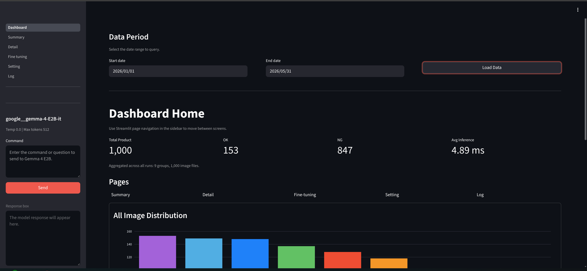

# 🏭 Manufacturing Inspection Dashboard

<p align="center">
  <a href="https://www.linkedin.com/posts/yuri-h-18670a304_ai-computervision-manufacturing-ugcPost-7449830679279742976-G7oc?utm_source=share&utm_medium=member_desktop&rcm=ACoAAE20GHYBQjrONldF5Ug1Emtcc3XKbVdKhjM">
    
  </a>
</p>


---

## 📌 Overview

A Streamlit dashboard project for semiconductor inspection images, supporting classification, inference, Active Learning-based sample selection, and fine-tuning.

---


## 🚀 Features

* Streamlit-based inspection dashboard
* MobileViT image classification training and inference
* Active Learning-based sampling
* Interactive fine-tuning with selected images
* Gemma-based assistant responses

---

## 🛠️ Installation

```bash
pip install -r requirements.txt
```

Required setup:

* Training/runtime config is no longer loaded from the legacy local `data` folder
* `.streamlit/secrets.toml`
* Optional: local model files in `model/google__gemma-4-E2B-it/`

---

## ▶️ Usage

### Dashboard

```bash
streamlit run streamlit_dashboard.py
```

---

## 📚 Documentation

- [Quick Start](docs/quickstart.md)


---

## 📂 Project Structure

```text
.
├── .streamlit/
├── assets/
├── data/
├── log/
├── model/
├── output/
├── pages/
├── scripts/
│   ├── detail_finetune_mcp.py
│   └── local_gemma_model.py
├── streamlit_dashboard.py
├── requirements.txt
└── README.md
```

---

## 📌 Notes

### Pages

* Dashboard : Data distribution, recent runs, latest logs, current model configuration
* Summary : Data distribution, normal/defect status, monthly/weekly/daily graphs, LLM comments
* Detail : Classification model inference results
* Fine tuning : Model selection, fine-tuning, Active Learning sampling, data labeling
* Setting : Database settings, LLM settings
* Log : Log history

### Version Update

* [Change Log](CHANGELOG.md)


#### Reference
- Data reference : [Semiconductor](https://www.kaggle.com/datasets/drtawfikrrahman/multi-class-semiconductor-wafer-image-dataset)
- Model : [Mobilevit_samll](https://huggingface.co/apple/mobilevit-small)