## 0. Installation

- Install the required packages.

```bash
pip install -r requirements.txt

cd third_party/OpenXAI
pip install -e .
```

- `OpenXAI` installation is required for XAI features.
- Download an LLM model.
  - Save it in the `model` folder.
  - The model folder name must match the expected name exactly.
  - [Gemma](https://huggingface.co/google/gemma-4-E4B-it)
  - Other LLM models can also be used.

## 1. Database connection

### Way1. Sample dataset
<p align="center">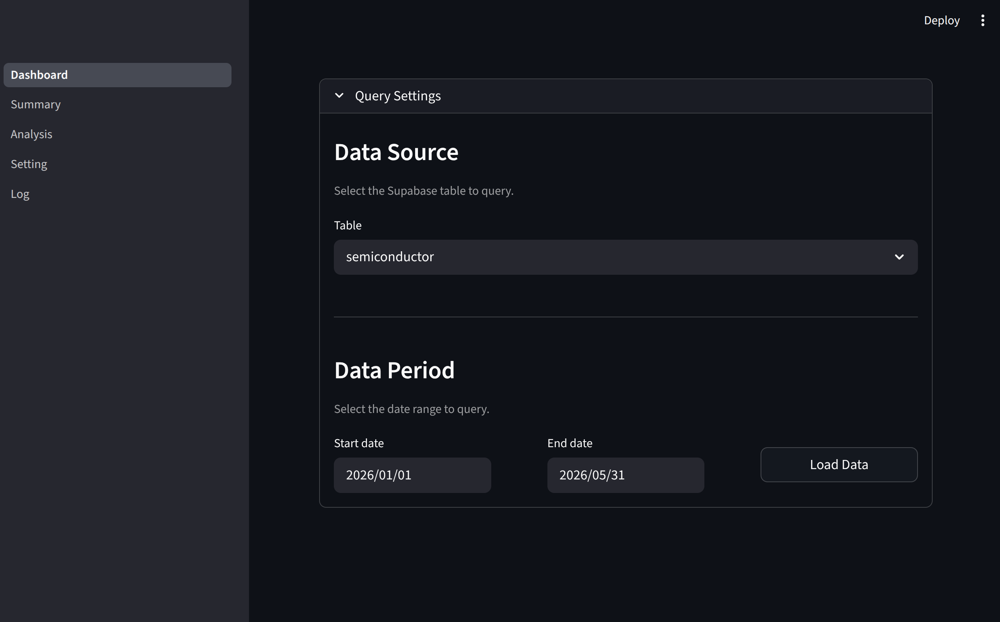</p>

- If no DB is connected, the app runs with the default sample data.
- Run the app, and the screen below appears. Filter the data period you want to analyze, then click the `Load Data` button to get started.


### Way2. Database - Supabase
- Create the `.streamlit/secrets.toml` file.
- Add the DB connection settings as shown below. This app currently supports only Supabase.
- On the `Setting` page, click `DB Settings` to change the DB connection settings.

```toml
[connections.supabase]
SUPABASE_URL = "http://000.0.0.0:12345"
SUPABASE_KEY = "abcdefghij"
```


## 2. Dashboard page
<p align="center">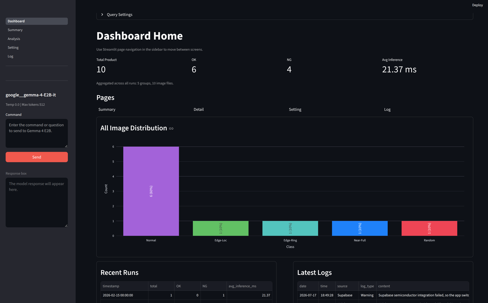</p>

- This page provides a summary view of the `Summary`, `Detail`, `Fine-tuning`, `Setting`, and `Log` pages.
- At the top of the page, set the data period and click `Load Data`. For sample data, keep the default date values.
- If you do not click `Load Data`, inference and other features will not run.

## 3. Summary page
<p align="center">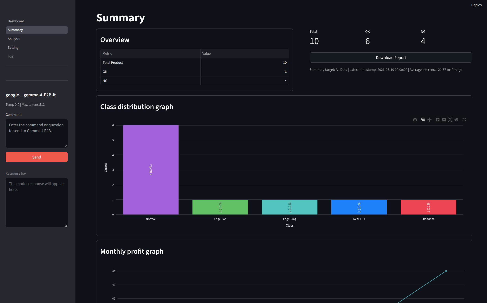</p>
- This page shows the data analysis summary.
<p align="center">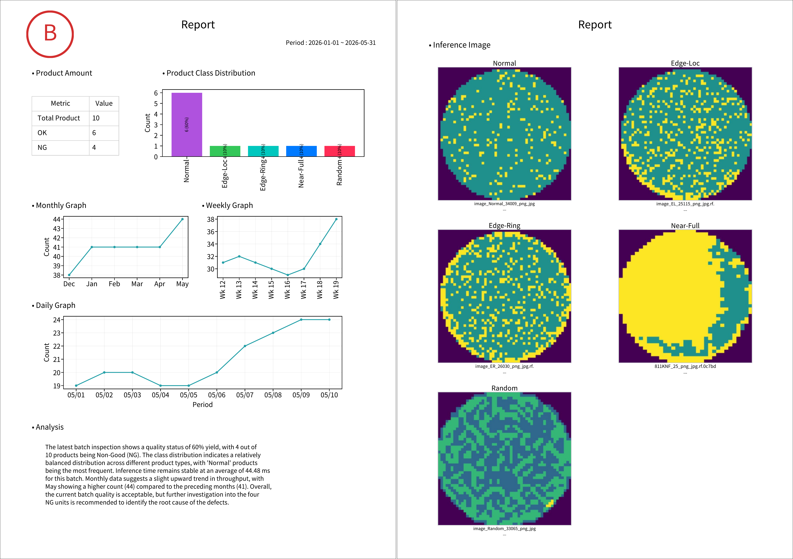</p>
- Click `Download Report` to save the current summary as a PDF file.

## 4. Analysis page
<p align="center">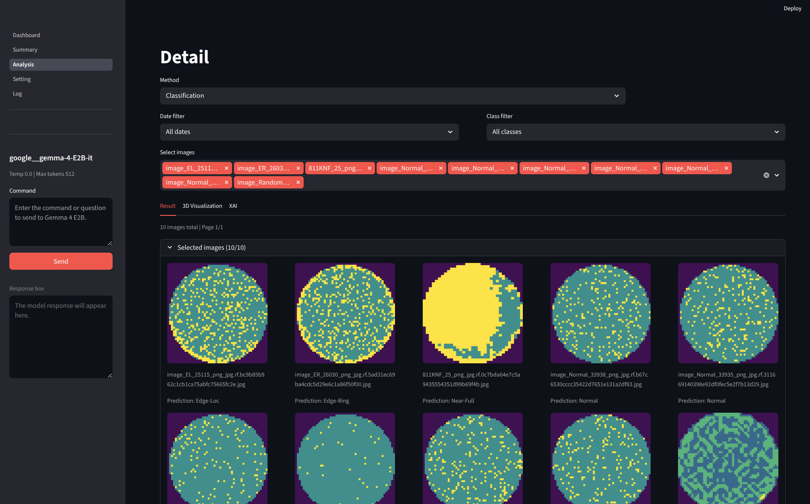</p>
- This page provides detailed AI inference results for images and related analysis features.
- Analysis starts only after you select images in `Select images`.
- Date and class filters are available.
- Use the `Method` selector to switch between `Classification` and `Anomaly Detection`.
  - In `Anomaly Detection` mode, click `Run Anomaly Detection` in the sidebar to extract features for the selected images and score them against the memory bank with a PatchCore-based scorer.
    <p align="center">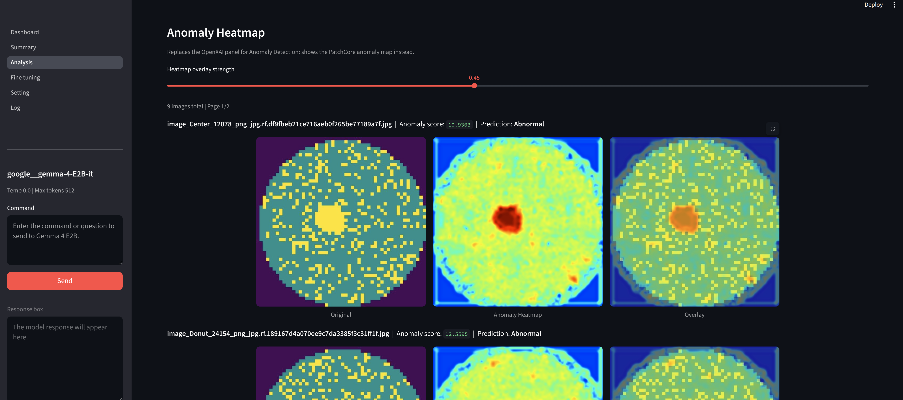</p>
- The `Result` tab shows the predicted class and image in `Classification` mode, or each image's anomaly score and Normal/Anomaly prediction (based on a calibrated threshold) in `Anomaly Detection` mode.
- The `3D Visualization` tab compresses the selected images' features into lower dimensions for visualization (PCA, t-SNE, or UMAP in `Classification` mode; patch-averaged, PCA-compressed features in `Anomaly Detection` mode). It works only when at least 3 images are selected.
  <p align="center">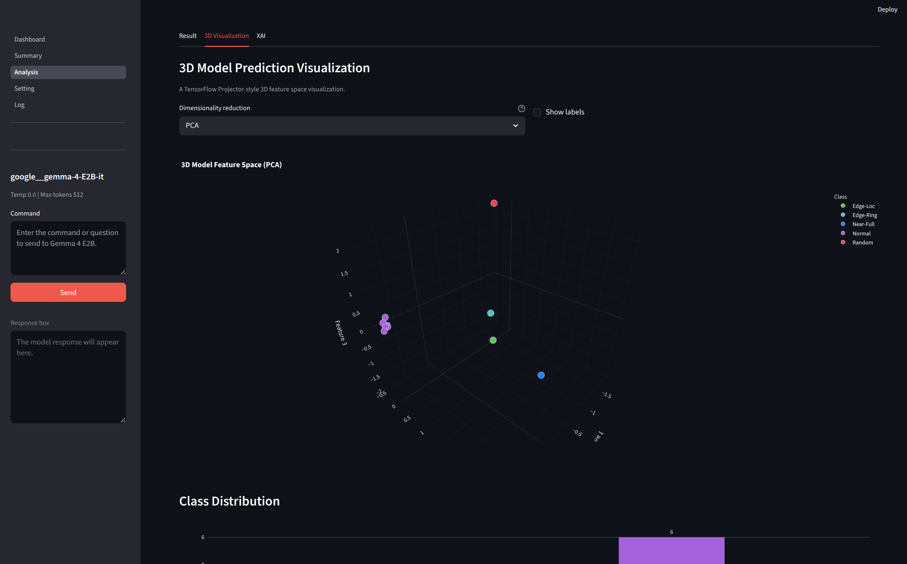</p>
- The `XAI` tab uses OpenXAI to help interpret the model's predictions in `Classification` mode. In `Anomaly Detection` mode, this tab is replaced by an `Anomaly Heatmap`, which overlays the PatchCore anomaly map on each image instead.
  <p align="center">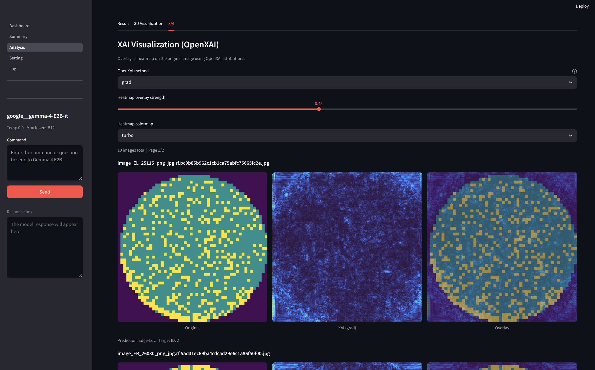</p>

## 5. Setting
<p align="center">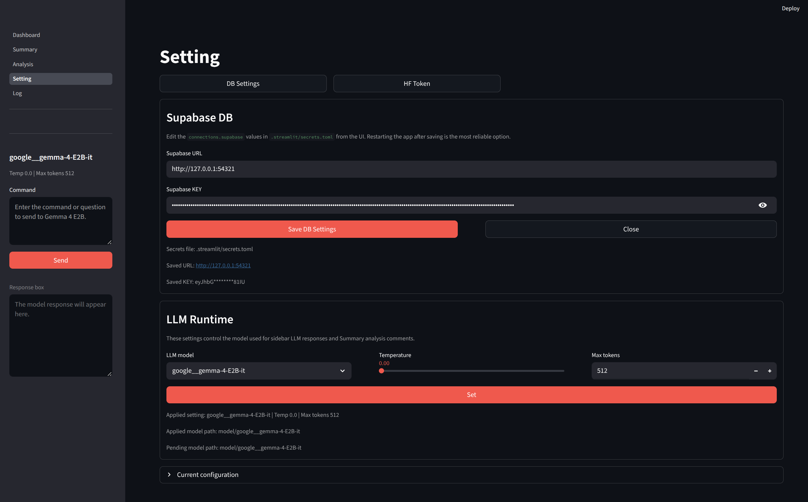</p>

- `DB Settings`: input values for the DB connection keys.
- `LLM Runtime`: options for the LLM model used in the left sidebar and in Summary analysis.

## 6. Log
<p align="center">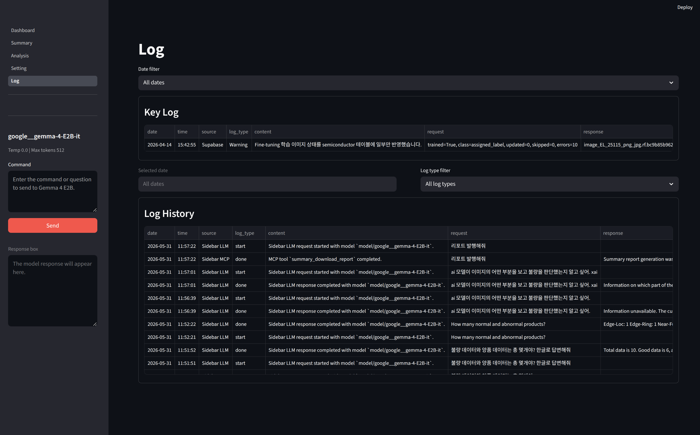</p>
- You can check the logs generated while using the app.
- Logs are automatically saved by date in the `log` folder.

## 7. Sidebar: LLM
<p align="center">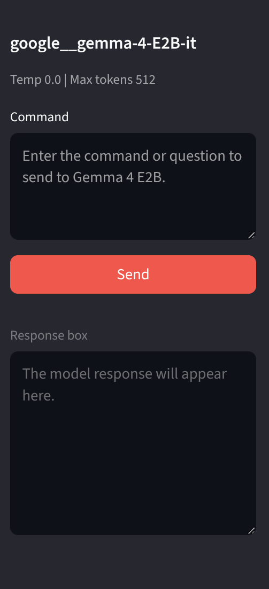</p>

- You can interact with the LLM through the command box in the sidebar.


#


<details>
<summary>Delete Function</summary>

- Fine-tuning

</details>